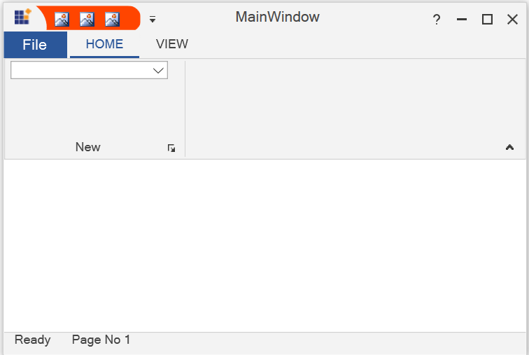

# How-to-change-the-back-color-of-QAT-in-WPF-Ribbon-control-
This repository contains the sample that how to change the back color of QAT in WPF Ribbon control?

The back color of Quick Access ToolBar (QAT) can be changed by using GeometryBackground property in WPF Ribbon control. To change the area back color of Quick Access ToolBar (QAT) the Brushes can be used to set proper color.


```XAML:

<syncfusion:Ribbon x:Name="_ribbon" VerticalAlignment="Top"  >
<syncfusion:Ribbon.QuickAccessToolBar>
<syncfusion:QuickAccessToolBar GeometryBackground="OrangeRed">
<syncfusion:RibbonButton SizeForm="ExtraSmall"/>
<syncfusion:RibbonButton SizeForm="ExtraSmall"/>
<syncfusion:RibbonButton SizeForm="ExtraSmall"/>
<syncfusion:QuickAccessToolBar.QATMenuItems>
<syncfusion:RibbonButton Label="Send" />
<syncfusion:RibbonButton Label="Forward" />
</syncfusion:QuickAccessToolBar.QATMenuItems>
</syncfusion:QuickAccessToolBar>
</syncfusion:Ribbon.QuickAccessToolBar>
<syncfusion:RibbonTab Caption="HOME"  IsChecked="True">
<syncfusion:RibbonBar x:Name="New" Width="170"  Header="New" >
</syncfusion:RibbonBar>
</syncfusion:RibbonTab>
<syncfusion:RibbonTab Caption="VIEW"  IsChecked="False"/>
</syncfusion:Ribbon>
```

Output:


